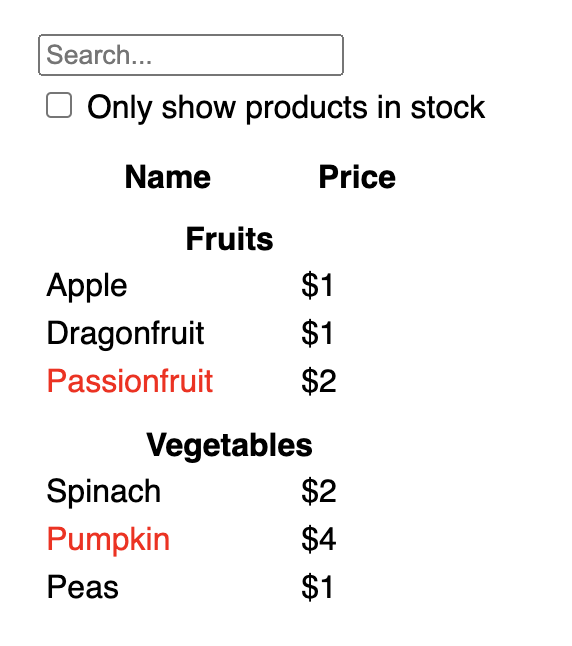
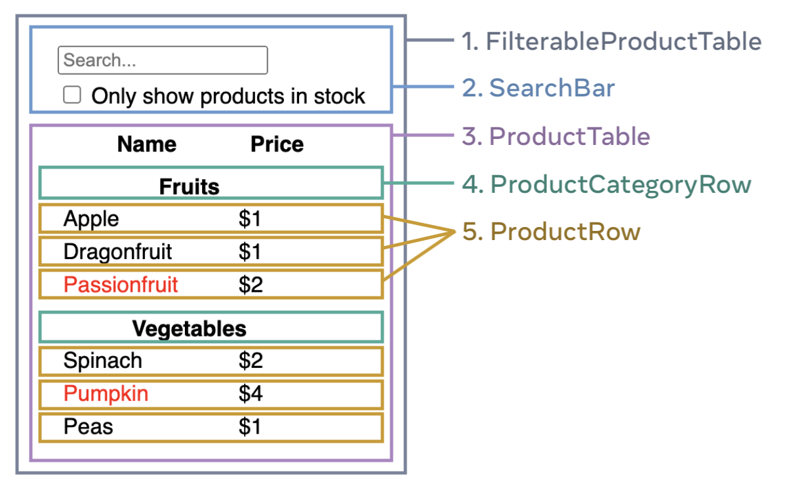

# Thinking in React

https://react.dev/learn/thinking-in-react

## Outcome (mockups)

## React Components 

Organization in React components

## Props vs State

Props vs State

There are two types of “model” data in React: props and state. The two are very different:

    Props are like arguments you pass to a function. They let a parent component pass data to a child component and customize its appearance. For example, a Form can pass a color prop to a Button.
    State is like a component’s memory. It lets a component keep track of some information and change it in response to interactions. For example, a Button might keep track of isHovered state.

Props and state are different, but they work together. A parent component will often keep some information in state (so that it can change it), and pass it down to child components as their props. It’s okay if the difference still feels fuzzy on the first read. It takes a bit of practice for it to really stick!